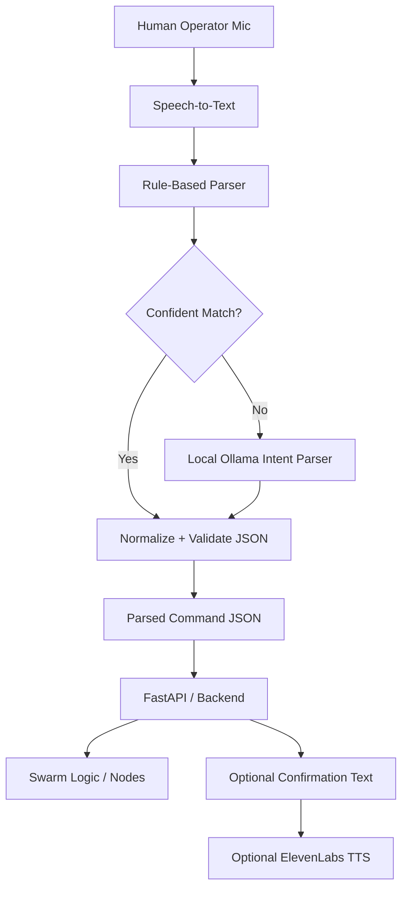

# Richard AI Bridge Sketch

## Purpose

Richard owns the `3.x.x` workstream in `development_gameplan.md`.
The goal of this module is narrow:

- accept transcribed human command text
- convert it into frozen, machine-readable JSON
- return parsed command data only

Everything downstream should consume validated JSON, not raw LLM output.

## Recommended Flow



## Why This Shape Makes Sense

- If the phrase is simple and matches a known pattern, a rule-based parser is faster and more reliable than an LLM.
- If the phrase is less direct, the local Ollama model can map natural language into the frozen schema.
- Validation is mandatory either way.
- ElevenLabs should be optional and should not affect whether command parsing succeeds.

## Frozen Output Contract

For `v1`, keep the contract intentionally small:

```json
{
  "schema_version": "1.0",
  "intent": "swarm_command",
  "goal": "ATTACK_AREA",
  "target_location": "GRID_ALPHA",
  "avoid_location": null,
  "confidence": 0.91
}
```

## Contract Rules

- `intent` is always `swarm_command`
- `goal` must be one of:
  - `MOVE_TO`
  - `ATTACK_AREA`
  - `AVOID_AREA`
  - `HOLD_POSITION`
  - `SCAN_AREA`
  - `ABORT`
  - `NO_OP`
- `target_location` must be a canonical ID like `GRID_ALPHA` or `null`
- `avoid_location` must be a canonical ID like `GRID_BRAVO` or `null`
- `confidence` must be a float from `0.0` to `1.0`
- if parsing fails, return a safe fallback such as:

```json
{
  "schema_version": "1.0",
  "intent": "swarm_command",
  "goal": "NO_OP",
  "target_location": null,
  "avoid_location": null,
  "confidence": 0.0
}
```

## Suggested Module Shape

Richard's public API should stay simple:

```python
process_voice_command(transcribed_text: str) -> dict
```

Suggested internal helpers:

- `parse_with_rules(text)`
- `parse_with_ollama(text)`
- `normalize_locations(payload)`
- `validate_command(payload)`
- `build_safe_fallback()`

## What Richard Needs To Provide

Before implementation, gather or define these inputs:

1. A frozen list of valid location IDs.
   Example: `GRID_ALPHA`, `GRID_BRAVO`, `GRID_CHARLIE`

2. A frozen list of valid goals.
   Example: `MOVE_TO`, `ATTACK_AREA`, `AVOID_AREA`, `SCAN_AREA`

3. The exact Ollama model name the team wants to try first.
   Start small if needed, but expect weaker schema compliance from a 1B model than a larger instruct model.

4. Ten to fifteen test phrases with expected outputs.
   Example:
   - "Move to Grid Alpha"
   - "Attack Grid Bravo"
   - "Avoid Grid Charlie"
   - "Hold position"
   - "Abort mission"

5. A decision on whether TTS is part of Richard's deliverable or just a stretch goal.
   If parsing is the true contract, keep TTS secondary.

6. The local `.env` file values for development.
   Those values should never be committed.

## What Should Go In `.env`

Use `base_station/.env` locally and keep it untracked.
The committed template lives in `base_station/.env.example`.

Expected values:

- `OLLAMA_BASE_URL`
- `OLLAMA_MODEL`
- `ELEVENLABS_API_KEY`
- `ELEVENLABS_VOICE_ID`
- `ELEVENLABS_MODEL_ID`
- `JARVIS_PARSER_MODE`
- `JARVIS_DEMO_MODE`
- `JARVIS_ALLOWED_GOALS`
- `JARVIS_ALLOWED_LOCATIONS`

## Secure Secret Handling

Use the normal local-development pattern:

- store real secrets in a local `.env` file
- commit only `.env.example`
- read secrets from environment variables in code
- never hardcode API keys in Python files
- never paste real secrets into markdown or git commits

If this later runs as a service on the Jetson, move the same values into the service environment instead of keeping secrets inside source code.

## Recommended Near-Term Order

1. Freeze goals and location IDs with the team.
2. Fill in `base_station/.env` locally.
3. Verify a single successful Ollama request.
4. Verify a single successful ElevenLabs request.
5. Implement rule-based parsing first.
6. Add Ollama as fallback for fuzzy phrasing.
7. Add validation and `NO_OP` fallback before integration.
